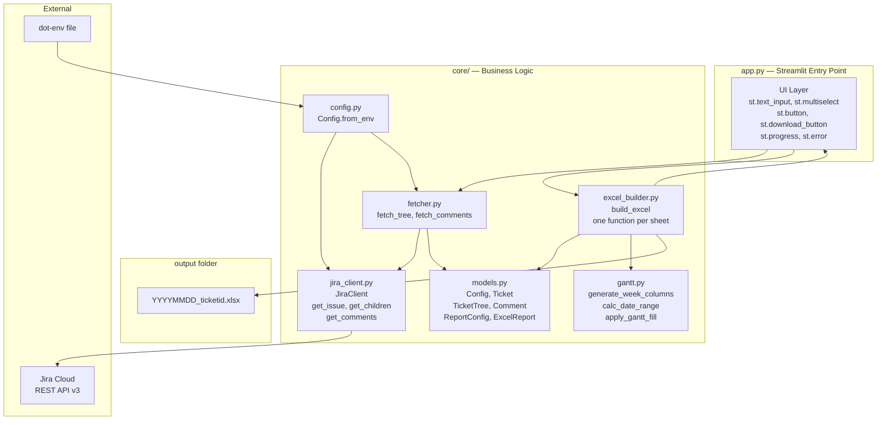
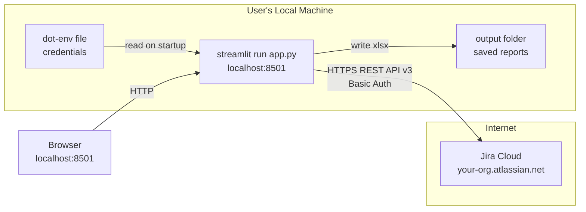
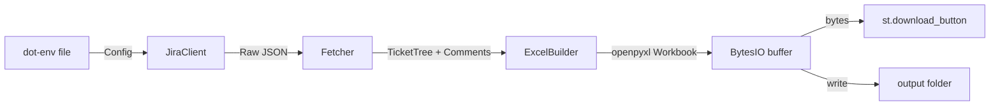

# architecture.md — Jira Feature Report Tool

---

## Component Architecture



---

## Module Responsibilities

| Module | Responsibility |
|---|---|
| `app.py` | Streamlit UI only. No business logic. Calls `fetch_tree`, `fetch_comments`, `build_excel`. |
| `core/config.py` | Loads and validates `.env`. Raises `ConfigError` if required vars missing. |
| `core/jira_client.py` | All HTTP calls to Jira. Auth, pagination, retry on 429. No domain logic. |
| `core/fetcher.py` | Orchestrates recursive tree fetch and comment fetch. Returns `TicketTree`. |
| `core/excel_builder.py` | Builds the openpyxl `Workbook`. One private function per sheet. |
| `core/gantt.py` | Pure date/calendar utilities. No Jira or openpyxl dependency. |
| `core/models.py` | Dataclasses only. No logic except simple helper methods on `TicketTree`. |

---

## Deployment Topology



---

## Data Flow



---

## File and Directory Structure

```
jira-report/
├── app.py                  # Streamlit entry point
├── .env                    # Credentials (not committed)
├── .env.example            # Template with all required keys
├── requirements.txt        # streamlit, requests, openpyxl, python-dotenv
├── output/                 # Auto-created; generated reports land here
└── core/
    ├── __init__.py
    ├── config.py
    ├── models.py
    ├── jira_client.py
    ├── fetcher.py
    ├── excel_builder.py
    └── gantt.py
```

---

## External Dependencies

| Library | Purpose |
|---|---|
| `streamlit` | UI framework |
| `requests` | Jira REST API HTTP calls |
| `openpyxl` | Excel file generation |
| `python-dotenv` | `.env` loading |

No other external dependencies. Standard library `datetime`, `dataclasses`, `io`, `os`, `pathlib` used freely.
