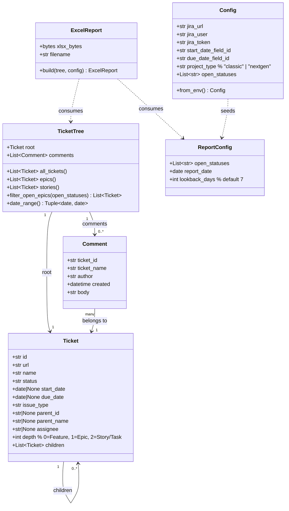

# data_model.md — Jira Feature Report Tool

The data model represents in-memory Python objects built from the Jira API response.
No persistent database is used; all state lives in memory during a single report generation run.

## Notes

- `Ticket.depth` drives sheet logic: depth=0 is the Feature, depth=1 are Epics, depth=2 are Stories/Tasks.
- `TicketTree.all_tickets()` returns a flat list in DFS order (Feature first, then each Epic and its children before the next Epic).
- `TicketTree.filter_open_epics()` is used by both Gantt sheets.
- `Comment.body` is stored as plain text (Jira ADF/markdown stripped); no rich text rendering in Excel.
- `start_date` and `due_date` are Python `datetime.date` objects (time component discarded).
- `Ticket.url` is constructed as `{jira_url}/browse/{id}` — not fetched from API.
