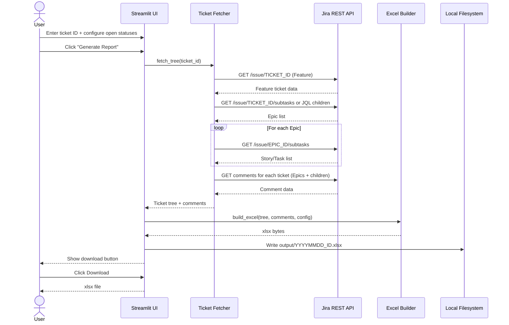
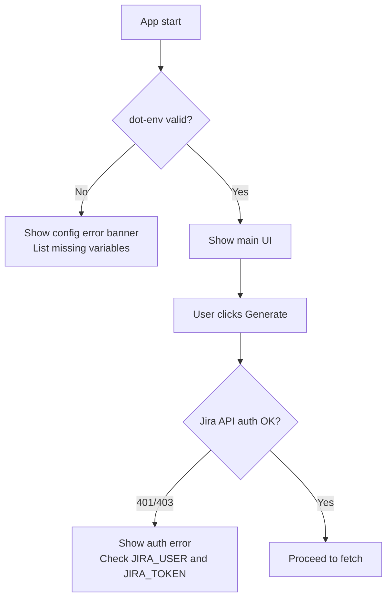
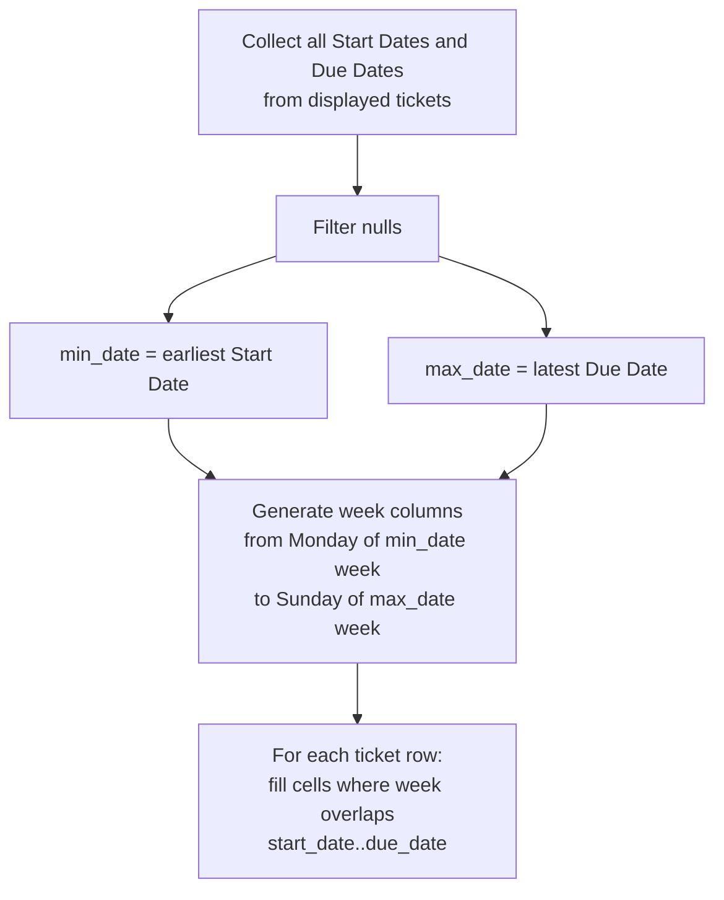
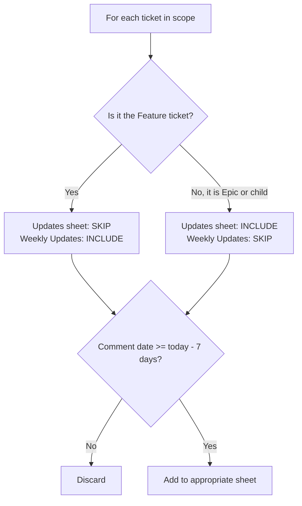

# spec.md — Jira Feature Report Tool

---

## Problem

Project managers and engineers tracking a large feature in Jira must manually navigate ticket hierarchies, copy data into spreadsheets, and build Gantt charts by hand. This is time-consuming, error-prone, and means status visibility is always stale. The tool must automate extraction of a full ticket tree from a single Jira Feature ticket and produce a structured, ready-to-share Excel workbook with multiple views.

**Who is affected:** Solo engineers or small teams using Jira who need a weekly status/reporting artefact without a dedicated PM tool.

---

## Context & Constraints

- Jira Cloud instance accessed via REST API v3 (Basic Auth: email + API token)
- Credentials stored in a `.env` file; never entered in the UI
- Ticket hierarchy: **Feature → Epic → Story/Task** (3 levels, fetched recursively)
- Date fields: `Start date` (custom field) and `Due date` (standard Jira field). Field IDs are configurable via `.env` because custom field IDs vary per Jira instance
- "Open" statuses for Gantt filtering are user-configurable in the Streamlit sidebar (default suggestions provided, but not hardcoded)
- Output: `.xlsx` downloaded via Streamlit button AND saved to `./output/` on the local filesystem
- Deployment: local only (`streamlit run app.py`); no Docker, no cloud
- UI framework: Streamlit

---

## Proposed Solution (High-Level)

A single-page Streamlit application that accepts a Jira Feature ticket ID, fetches the full ticket tree via the Jira REST API, and generates a multi-worksheet Excel report.

### Actors

- **User** — runs the app locally, enters a ticket ID, downloads the report

### Capabilities

- **cap-001** — Credential and configuration loading from `.env`
- **cap-002** — Jira API client: authentication, rate-limit handling, error reporting
- **cap-003** — Recursive ticket tree fetcher (Feature → Epic → Story/Task, max 3 levels)
- **cap-004** — Streamlit UI: ticket ID input, open-status configurator, run button, status feedback, download button
- **cap-005** — Excel worksheet: **Tickets** — flat list of all tickets with all required fields
- **cap-006** — Excel worksheet: **Simplified Gantt** — open Epics only, ordered by due date (nulls last), week-column calendar
- **cap-007** — Excel worksheet: **Full Gantt** — same as Simplified Gantt but with first-level children (Stories/Tasks) listed under each Epic, showing status only (no dates for children)
- **cap-008** — Excel worksheet: **Updates** — comments on Epics and Stories/Tasks from the last 7 days
- **cap-009** — Excel worksheet: **Weekly Updates** — comments on the root Feature ticket only, from the last 7 days
- **cap-010** — Excel file delivery: Streamlit download button + saved to `./output/YYYYMMDD_<ticket-id>.xlsx`

---

## Acceptance Criteria

**cap-001**
- App starts without error when `.env` contains `JIRA_URL`, `JIRA_USER`, `JIRA_TOKEN`, `JIRA_START_DATE_FIELD`, and `JIRA_DUE_DATE_FIELD`
- App shows a clear error message if any required variable is missing

**cap-002**
- Authenticated requests succeed against the configured Jira instance
- HTTP 401/403 surfaces a user-readable error in the UI (not a stack trace)
- HTTP 429 (rate limit) is retried with exponential back-off (max 3 retries)

**cap-003**
- Given a Feature ticket ID, the fetcher returns the Feature + all Epics linked as children + all Stories/Tasks linked under each Epic
- Fetcher correctly handles Epics with zero children
- Fetcher correctly handles Features with zero Epics
- Depth is capped at 3 levels; no infinite recursion

**cap-004**
- User can type or paste a ticket ID (e.g. `MTC-1234`) into an input field
- User can add/remove status values from an "open statuses" multi-select in the sidebar
- A "Generate Report" button triggers the full fetch + export pipeline
- A progress indicator is shown while fetching
- Errors are shown inline (not as exceptions)

**cap-005 — Tickets sheet**
- One row per ticket (all levels)
- Columns: ID, Link (hyperlink to Jira), Name, Status, Start Date, Due Date, Issue Type, Parent ID, Parent Name, Assignee
- Null dates remain blank (not zero or epoch)

**cap-006 — Simplified Gantt sheet**
- Rows contain only Epic-level tickets that have an "open" status (as configured)
- Rows ordered by Due Date ascending; tickets with no Due Date appear at the bottom
- Each row shows: ID, Name, Assignee, Status, Start Date, Due Date
- Calendar columns are weeks (Mon–Sun); each week column header shows the Monday date of that week
- Cells within a ticket's date range are filled/highlighted; cells outside are blank
- Calendar spans from the earliest Start Date to the latest Due Date across all displayed tickets

**cap-007 — Full Gantt sheet**
- Same Epic rows and calendar as Simplified Gantt (same open-status filter, same ordering)
- Below each Epic, its direct children (Stories/Tasks) are listed as sub-rows
- Sub-rows show: ID, Name, Assignee, Status only — no date columns filled
- Visual indentation distinguishes sub-rows from Epic rows

**cap-008 — Updates sheet**
- One row per comment, from Epics and their children (not the Feature ticket)
- Only comments created or updated in the last 7 calendar days
- Columns: Ticket ID, Ticket Name, Author, Date, Comment Text
- Ordered by Date descending

**cap-009 — Weekly Updates sheet**
- One row per comment on the root Feature ticket only
- Only comments from the last 7 calendar days
- Columns: Author, Date, Comment Text
- Ordered by Date descending

**cap-010**
- After generation, a Streamlit `st.download_button` allows the user to download the `.xlsx`
- The same file is simultaneously written to `./output/YYYYMMDD_<ticket-id>.xlsx`
- `./output/` is created automatically if it does not exist

---

## Key Flows

### flow-01 — Happy Path: Generate Report

User opens the app, enters a Feature ticket ID, configures open statuses, clicks Generate, and downloads the report.

### flow-02 — Credential / Auth Error

### flow-03 — Gantt Date Range Calculation

### flow-04 — Comment Filtering

---

## Technical Considerations

- **Jira child-link strategy:** Jira Cloud does not have a universal parent/child API. Children of a Feature are typically fetched via JQL: `"Epic Link" = MTC-1234` or via the `parent` field for next-gen projects. This **must be validated** against the specific Jira project type (classic vs. next-gen) before implementation. The fetcher should support both strategies, configurable via `.env` (`JIRA_PROJECT_TYPE=classic|nextgen`).
- **Custom field IDs:** `Start date` is a custom field. Its field ID (e.g. `customfield_10015`) varies per Jira instance and must be discoverable. The spec assumes the user will look up their field ID via `/rest/api/3/field` and put it in `.env`.
- **Gantt rendering in openpyxl:** Week-column Gantts require iterating over date ranges and applying cell fills. `openpyxl` is the right library; no charting engine needed — coloured cells are sufficient.
- **Comment pagination:** Jira comments API paginates at 50 by default. The fetcher must handle pagination for tickets with many comments.
- **Performance:** A Feature with 5 Epics × 20 Stories = ~105 API calls minimum (plus comment calls). This may take 10–30 seconds. A progress bar or spinner is required.

---

## Risks, Rabbit Holes & Open Questions

**Risks**
- Jira project type (classic vs. next-gen) affects how child tickets are fetched. Wrong strategy = empty results with no obvious error.
- Custom field IDs for `Start date` differ per instance. A missing or wrong field ID produces silently blank date columns.

**Rabbit Holes — do NOT go here**
- Do NOT build a Jira field auto-discovery UI. Field IDs go in `.env`, period.
- Do NOT implement OAuth / Atlassian Connect. Basic Auth with API token is sufficient.
- Do NOT attempt to render a graphical Gantt chart (PNG/SVG). Coloured cells in Excel are the target output.
- Do NOT support editing or writing back to Jira.
- Do NOT paginate more than 3 levels deep. Cap at Feature → Epic → Story/Task.

**Open Questions**
- What is the Jira project type for MTC? (classic vs. next-gen — determines child-fetch JQL strategy)
- What is the custom field ID for `Start date` in this Jira instance?

---

## Scope: IN vs OUT

### IN scope
- Single Streamlit page app, local execution
- `.env`-based credential and config management
- Recursive fetch: Feature → Epic → Story/Task (3 levels max)
- Five Excel worksheets as specified (Tickets, Simplified Gantt, Full Gantt, Updates, Weekly Updates)
- Configurable open-status list in sidebar
- Download button + local file save
- Basic error handling for auth failures and missing config

### OUT of scope
- Multi-feature or multi-project reports
- OAuth or SSO authentication
- Jira write-back (creating/updating tickets)
- Graphical Gantt charts (images, SVG, HTML)
- Scheduling or automated report delivery (email, Slack)
- Support for Jira Server / Data Center (Cloud API only)
- More than 3 levels of ticket hierarchy
- Historical report diffing or trend tracking

### Cut list (drop if scope must shrink)
- Full Gantt sheet (keep Simplified Gantt; drop Full Gantt)
- Local file save (keep download button only)
- Weekly Updates sheet (merge into Updates sheet with a filter column)
