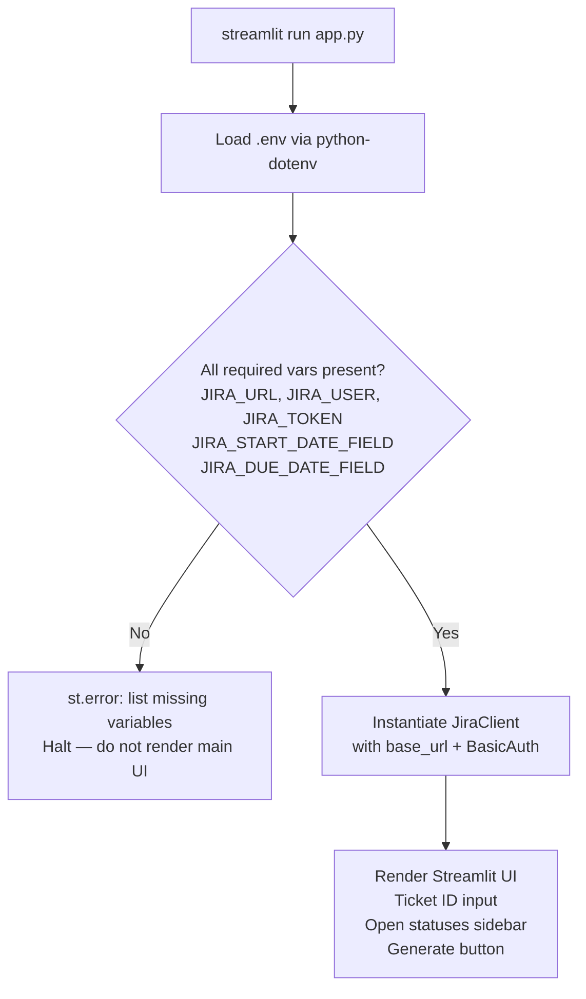
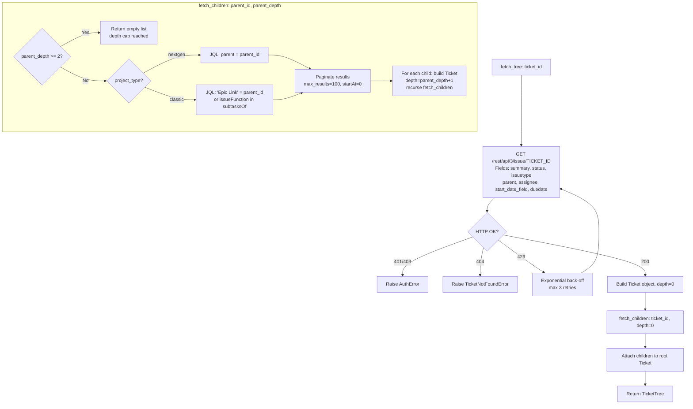
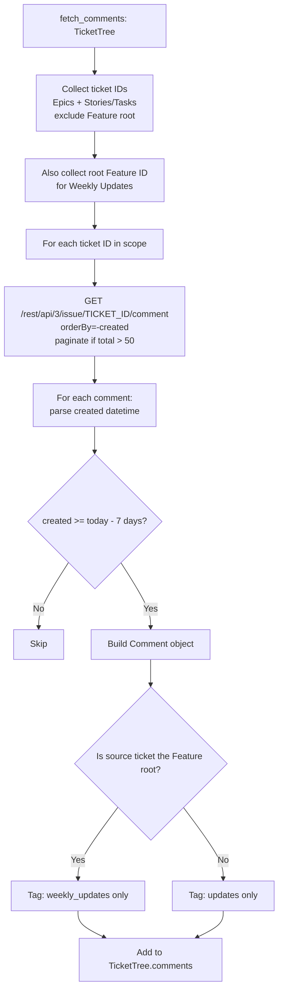
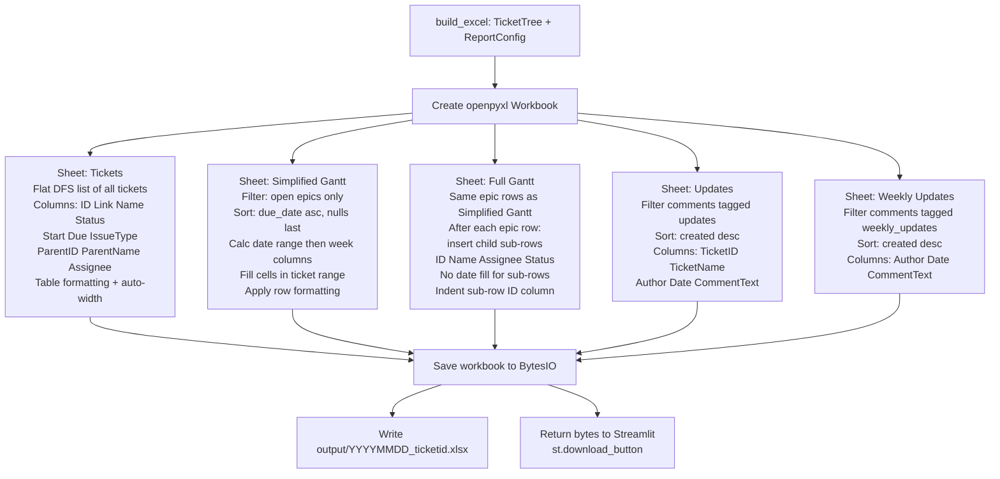
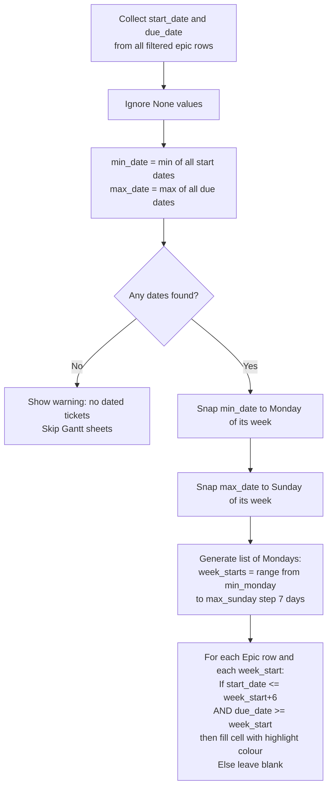

# workflows.md — Jira Feature Report Tool

---

## WF-01: Application Startup and Config Validation (cap-001, cap-002)

---

## WF-02: Recursive Ticket Tree Fetch (cap-002, cap-003)

---

## WF-03: Comment Fetch and Routing (cap-008, cap-009)

---

## WF-04: Excel Report Construction (cap-005, cap-006, cap-007, cap-008, cap-009, cap-010)

---

## WF-05: Gantt Week-Column Generation (cap-006, cap-007)

