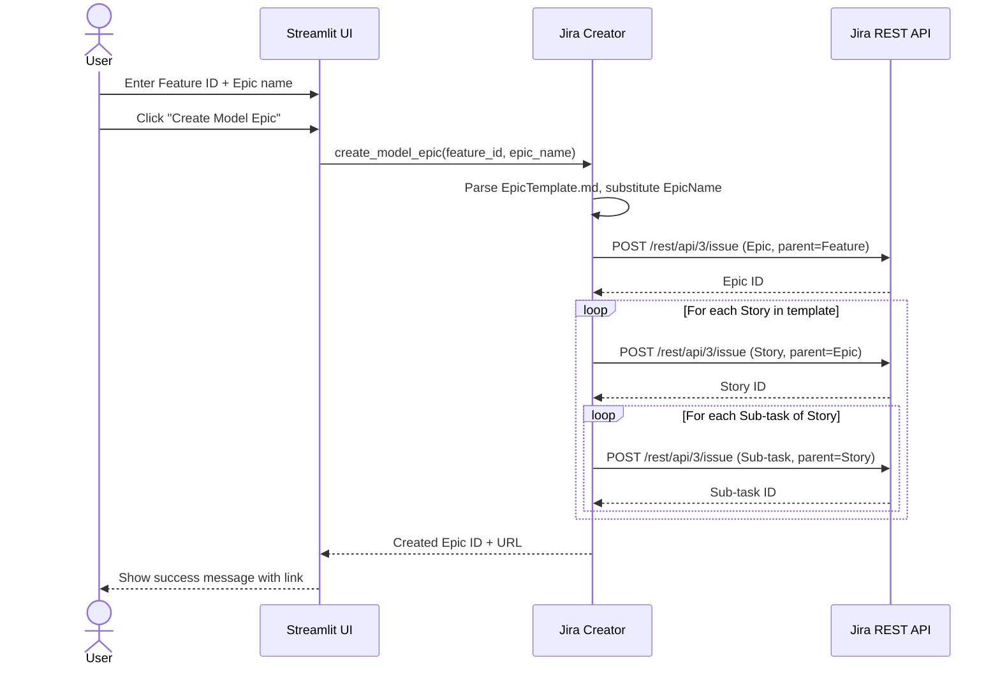
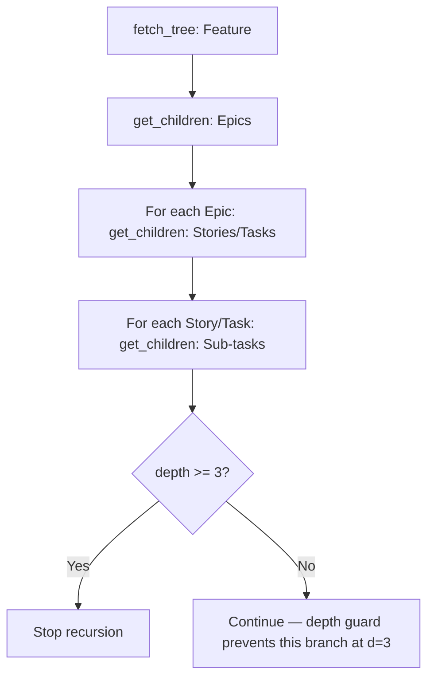

# spec.md — Jira Tool Enhancements: Depth, Gantt Visuals, Model Epic Creator

---

## Problem

P-0001 delivered a working Jira report tool, but three gaps have been identified through usage:

1. **Incomplete hierarchy fetch:** The fetcher caps at 3 levels (Feature → Epic → Story/Task), missing Sub-tasks that exist at depth 4. Reports are therefore incomplete for any epic that uses sub-tasks.
2. **Undifferentiated Gantt visuals:** All tickets share a single fill color regardless of status, making it impossible to read ticket health at a glance. Epics and their children are visually undistinguishable in the Full Gantt.
3. **Manual epic creation:** Teams create a standard "model" epic structure repeatedly in Jira by hand. This is error-prone and time-consuming. The tool should be able to create this structure automatically from a fixed template.

**Who is affected:** Same user as P-0001 — a solo engineer or small team running the app locally.

---

## Context & Constraints

- All changes are additive; no existing Excel sheet structure or API contract changes except where explicitly stated.
- The template for "Create Model Epic" is fixed at `docs/Projects/P-0002/EpicTemplate.md`. Do NOT build a template editor or upload UI.
- The Jira write API uses the same credentials already in `.env`.
- The Create Model Epic feature targets the same Jira instance configured in `.env`. No new credential fields are required.
- Issue types for created tickets are fixed: Epic at depth 0, Story at depth 1, Sub-task at depth 2.
- `JIRA_PROJECT_TYPE` in `.env` already distinguishes classic vs. next-gen and must be respected when creating child links.

---

## Proposed Solution (High-Level)

Extend the existing Streamlit app in three independent areas:

### Actors

- **User** — runs the app locally; no change from P-0001

### Capabilities

- **cap-001** — Extend recursive fetcher to 4 levels (Feature → Epic → Story/Task → Sub-task); all retrieved tickets flow through to comments and Tickets sheet automatically.
- **cap-002** — Status-based color palette for Gantt week cells and Status column cells (both Simplified and Full Gantt sheets).
- **cap-003** — Visual separators in Full Gantt: thick bottom border after each Epic group, thin bottom border after each child row.
- **cap-004** — Full Gantt child and sub-task ordering: sort first-level children (Stories/Tasks) by ticket ID ascending within each Epic; sort sub-tasks by ticket ID ascending within each Story/Task.
- **cap-005** — Streamlit UI section: "Create Model Epic" — feature ID input (shared field), epic name input, create button, inline success/error feedback.
- **cap-006** — Jira ticket creator module: parse `EpicTemplate.md`, substitute `EpicName` with user-provided name, create Epic + Stories + Sub-tasks in Jira under the given Feature ID, no assignee/dates/description on any ticket.

---

## Acceptance Criteria

**cap-001**
- Fetcher retrieves tickets at depth 0 (Feature), 1 (Epic), 2 (Story/Task), and 3 (Sub-task).
- Sub-tasks appear in the Tickets sheet.
- Comments are fetched for Sub-tasks alongside all other tickets.
- Depth is capped at 4 levels; no infinite recursion.
- Features/Epics/Stories with zero children at any level are handled without error.

**cap-002**
- Each distinct status value maps to a unique fill color per the defined palette (see Technical Considerations).
- Gantt week cells that are filled use the status color of that ticket row, not a single fixed blue.
- The Status column cell in both Gantt sheets is filled with the same status color.
- Tickets with an unrecognised status fall back to a neutral gray.

**cap-003**
- In the Full Gantt, a thick bottom border (medium weight) is applied to the last row of each Epic group (the row immediately before the next Epic row, or the last row of the sheet).
- A thin bottom border is applied to each child row (Stories/Tasks and Sub-tasks).
- No blank rows are inserted; separators are purely border-based.

**cap-004**
- In the Full Gantt, the children of each Epic are listed in ascending ticket ID order (e.g. MTC-10 before MTC-20).
- Sub-tasks within each Story/Task are listed in ascending ticket ID order.
- Ticket ID sort is numeric-aware (MTC-9 before MTC-10, not MTC-10 before MTC-9).

**cap-005**
- A "Create Model Epic" section is visible below the report form in the main area, always rendered regardless of report state.
- The user enters a Feature ID (text input) and an Epic name (text input).
- A "Create Model Epic" button is disabled when either field is empty.
- On success: a green success message shows the created Epic's Jira ticket ID and URL.
- On failure: an inline error message is shown; no stack trace.

**cap-006**
- The creator reads `docs/Projects/P-0002/EpicTemplate.md` at runtime.
- Each `EpicName` token in the template is replaced with the user-provided name.
- The resulting hierarchy is: Epic at depth 0, Stories/Tasks at depth 1 (4-space indent), Sub-tasks at depth 2 (8-space indent).
- Tickets are created in order: Epic first, then each Story in template order, then each Story's Sub-tasks before the next Story.
- The Epic is linked to the Feature ID as its parent.
- Each Story is linked to the Epic as its parent.
- Each Sub-task is linked to its Story as its parent.
- No assignee, due date, start date, or description is set on any created ticket.
- The Epic is named `[MODEL] {user_provided_name}`.
- All Stories and Sub-tasks are named exactly as the substituted template line (e.g. `UserName -> Implement -> Research`).

---

## Key Flows

### flow-01 — Create Model Epic (happy path)

### flow-02 — Fetch Sub-tasks (extended depth)

---

## Technical Considerations

### Status Color Palette

| Status | Hex Color | Fill Description |
|---|---|---|
| Backlog | `C9C9C9` | Light gray |
| To Do | `8DB4E2` | Soft blue |
| In Progress | `00B0F0` | Bright blue (existing) |
| In Review | `FFC000` | Amber |
| Waiting for Response | `F4B942` | Dark amber |
| Pending Manager Approval | `C39BD3` | Soft purple |
| Blocked | `FF6B6B` | Soft red |
| On Hold | `F8A487` | Salmon |
| Done | `00B050` | Green |
| Closed | `A6A6A6` | Medium gray |
| Cancelled | `E8A598` | Dusty rose |
| Duplicate | `E8A598` | Dusty rose (same as Cancelled) |
| *(unknown)* | `EBEBEB` | Fallback light gray |

### Jira Creator API

- Use `POST /rest/api/3/issue` with Basic Auth (same credentials as existing client).
- For next-gen projects, set `parent.key` in the issue body to link child to parent.
- For classic projects, use `customfield_10014` (Epic Link) for the Epic→Feature link, and `parent.key` for Story→Epic and Sub-task→Story links.
- Issue type names: `Epic`, `Story`, `Sub-task` — these are standard Jira Cloud names. If a project uses different names, the creation will fail with a clear Jira error message surfaced to the user.

### Template Parsing

- Read `EpicTemplate.md` line by line.
- Depth = `(number of leading spaces) / 4`.
- Depth 0 (no indent) = the Epic itself — skip this line; the Epic name comes from user input.
- Depth 1 (4 spaces) = Story/Task — create with substituted name.
- Depth 2 (8 spaces) = Sub-task — create as child of the most recently created Story.
- Replace all occurrences of the literal string `EpicName` with the user-provided name before creating any ticket.

### Ticket ID Sort (Numeric-Aware)

- IDs are in the format `PREFIX-NNN` (e.g. `MTC-9`, `MTC-10`).
- Sort key: extract the numeric suffix and sort as integer.
- `int(id.split("-")[-1])` is sufficient if all IDs share the same prefix.

---

## Risks, Rabbit Holes & Open Questions

**Risks**
- Jira's issue type names (`Story`, `Sub-task`) may differ in some projects (e.g. `Task`, `Subtask`). If creation fails, the error from Jira is surfaced as-is.
- For classic projects, the Epic Link field ID `customfield_10014` is standard but may differ. This should be validated at runtime.

**Rabbit Holes — do NOT go here**
- Do NOT build a template editor, template uploader, or any way for the user to modify `EpicTemplate.md` through the UI.
- Do NOT add a "preview" step before creation — create immediately on button click.
- Do NOT implement bulk creation (multiple epics at once).
- Do NOT paginate or validate the Feature ID before attempting creation — let Jira return the error.
- Do NOT add configurable issue type names in this version — use `Epic`, `Story`, `Sub-task` as-is.

**Open Questions**
- (Resolved) Issue types are fixed: Epic / Story / Sub-task.
- (Resolved) No assignee, dates, or description on any created ticket.

---

## Scope: IN vs OUT

### IN scope
- Fetcher extended to depth 4 (Sub-tasks)
- Status-based Gantt color palette (both Gantt sheets, week cells + Status column)
- Thick/thin border separators in Full Gantt
- Numeric-aware child ordering in Full Gantt
- Create Model Epic section in main UI area
- Jira creator module using fixed EpicTemplate.md
- All error states surfaced inline

### OUT of scope
- Configurable issue type names
- Template editing or upload UI
- Preview/dry-run before creation
- Bulk epic creation
- Any write-back other than Create Model Epic
- Changes to architecture, data model, or workflow diagrams (no new data entities; creator is a stateless function)
