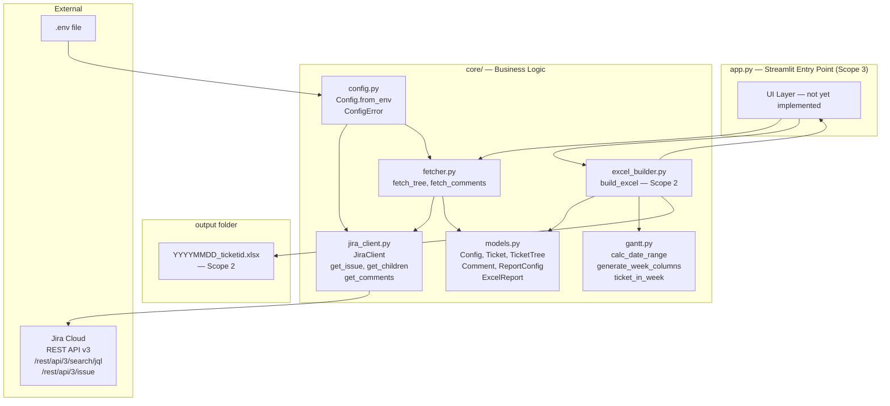
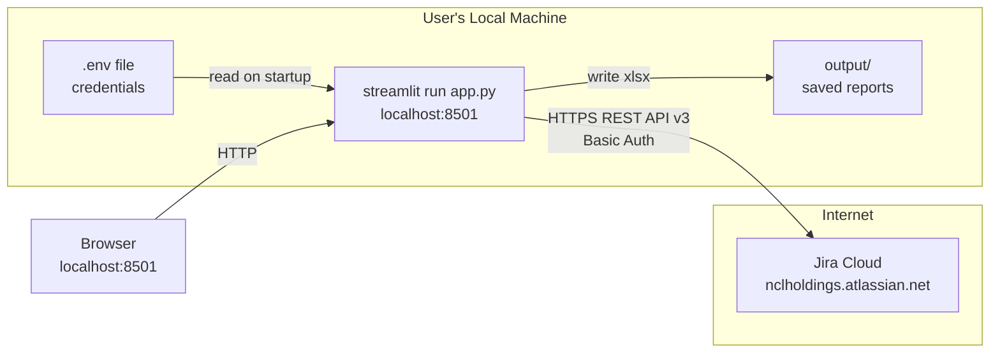
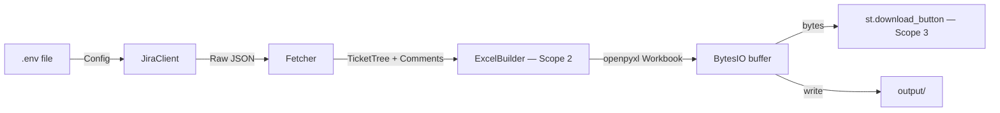

# System Architecture — Jira Feature Report Tool

## High-Level Component Architecture

## Deployment Topology

## Data Flow

## Jira API Notes

- **Search endpoint:** `/rest/api/3/search/jql` (the older `/rest/api/3/search` was deprecated and returns HTTP 410)
- **Pagination:** Token-based via `nextPageToken` / `isLast` (not `startAt` / `total`)
- **Fields:** Must request `fields=*all` to get full issue data from search results
- **Child fetch strategy (nextgen):** `parent = <TICKET_ID>` JQL
- **Child fetch strategy (classic):** `"Epic Link" = <TICKET_ID>` JQL
- **Comments:** `/rest/api/3/issue/<ID>/comment` with `startAt`/`maxResults` pagination (still uses offset-based)
- **Rate limiting:** Exponential backoff on HTTP 429 (delays: 1s, 2s, 4s, max 3 retries)
