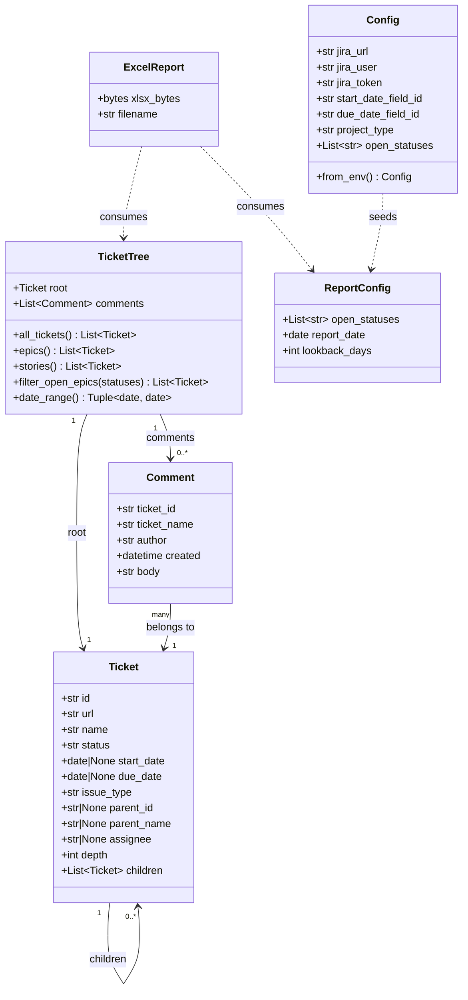

# Data Model — Jira Feature Report Tool

No persistent database. All state is in-memory during a single report generation run.

## Field Mapping

| Model Field | Jira Source |
|---|---|
| `Ticket.id` | `issue.key` |
| `Ticket.url` | `{jira_url}/browse/{key}` (constructed) |
| `Ticket.name` | `fields.summary` |
| `Ticket.status` | `fields.status.name` |
| `Ticket.start_date` | `fields.customfield_10039` |
| `Ticket.due_date` | `fields.duedate` |
| `Ticket.issue_type` | `fields.issuetype.name` |
| `Ticket.assignee` | `fields.assignee.displayName` (null-safe) |
| `Ticket.parent_id` | Passed from parent during recursion |
| `Ticket.parent_name` | Passed from parent during recursion |
| `Comment.author` | `comment.author.displayName` |
| `Comment.created` | `comment.created` (ISO 8601, truncated to seconds) |
| `Comment.body` | `comment.body` (ADF → plain text extraction) |
