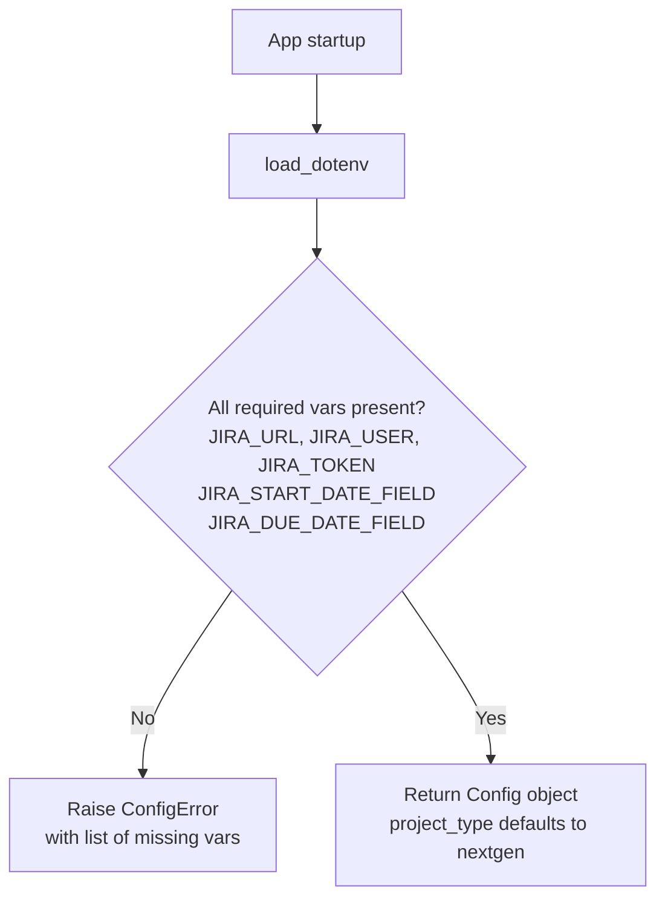
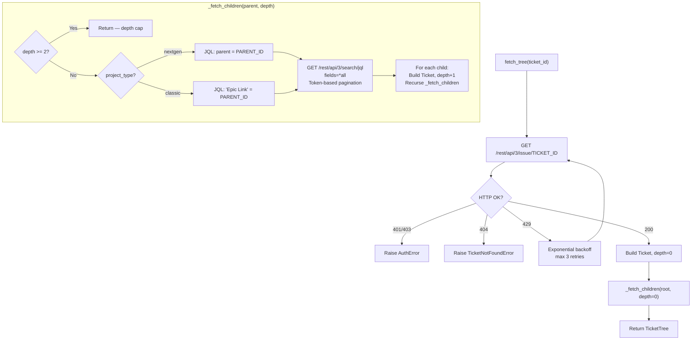
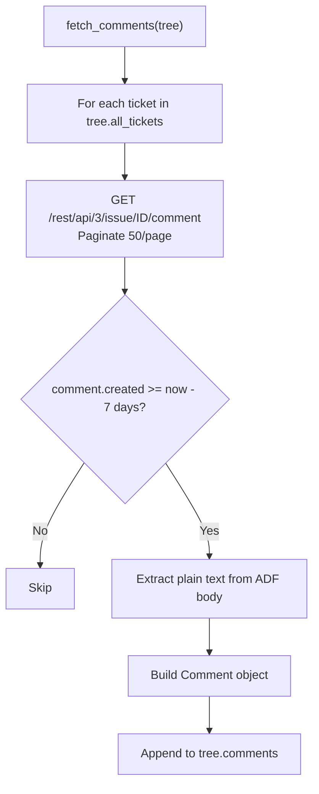
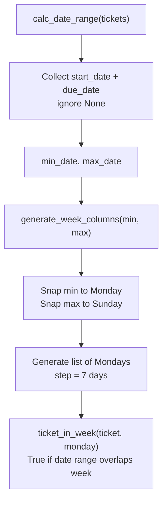

# System Workflows — Jira Feature Report Tool

## WF-01: Config Loading (cap-001)

## WF-02: Recursive Ticket Tree Fetch (cap-002, cap-003)

## WF-03: Comment Fetch (cap-008, cap-009)

## WF-04: Gantt Date Utilities (cap-006, cap-007)

